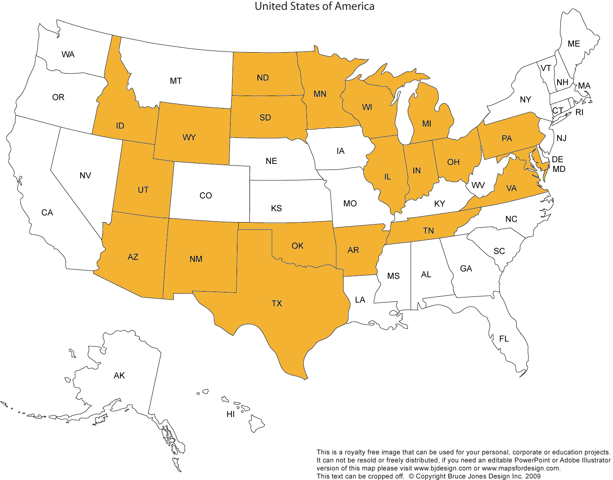

# States We Traveled Through (in order of travel)
1. Virginia
1. Tennessee
1. Arkansas
1. Oklahoma
1. Texas
1. New Mexico
1. Arizona
1. Utah
1. Idaho
1. **Montana** *
1. Wyoming
1. South Dakota
1. North Dakota
1. Minnesota
1. Wisconsin
1. Illinois
1. Indiana
1. Michigan
1. Ohio
1. Pennsylvania
1. **West Virginia** *
1. Maryland


* We did not originally plan on driving through these states, but ended up cutting across parts of them.

# Resources for Booklet:
- USA Map: http://www.freeusandworldmaps.com/html/USAandCanada/USPrintable.html
- States Word Search: http://www.puzzles.ca/wordsearch/usa_states.html
- States Crossword Puzzle: http://www.ducksters.com/games/crossword_puzzle/united_states_geography.php
- License Plates: http://www.15q.net/curr.html
- State quizzes and maps: http://www.enchantedlearning.com/usa/statesbw/
- Booklet Maker: https://github.com/roberto-arista/Python-Print-Booklet
- Yellowstone Map: http://www.theydrawandtravel.com/maps/yellowstone-national-park-wyoming-kate-rochester
- Animals
  - eagle: https://www.pinterest.com/pin/100275529180232350/
  - buffalo: http://101coloringpages.com/b/buffalo-coloring-pages/
  - horse: http://www.freestockphotos.biz/stockphoto/11453
  - big horn: http://www.usbr.gov/lc/hooverdam/educate/edpack2.html
  - cows: http://www.jc-solarhomes.com/GREEN/green%20living/green_living_tips.htm
  - tarantula: http://www.desertmuseum.org/books/nhsd_scorpions.html
  - frog: http://www.desertmuseum.org/books/nhsd_bufo.php
  - wolf: http://momsinamerica.com/color/wolf-coloring-pages-to-print/
  - deer: https://commons.wikimedia.org/wiki/File:Deer_1_(PSF).png
- Mazes
  - Illinois: http://www.imaginaryanimal.com/products/illinois-state-maze
  - Michigan: http://www.imaginaryanimal.com/products/michigan-state-maze-offset-print
  - New Mexico, Ohio: http://vikiwoodworth.blogspot.com/2009/05/united-states-maze-craze.html
  - North America: http://bicycletouringpro.com/blog/north-america-maze-free-download/


# Notes for creating the booklet

- Create a PDF using your favorite document creator
- The number of pages must be evenly divisible by 4 (a multiple of four).
- Follow the instructions on the github repo to install PyPDF2
  - Download the `print_booklet.py` file (or clone the repo)
  - Run as 
    ```
    python path/to/print_booklet.py path/to/Your-File.pdf
    ```
  - The generated file will be at `path/to/Your-File-IMPOSED.pdf`

# Printing tips

- Printing the PDF from Mac's Preview App: 
  - It's easiest if your printer can print Two-Sided, if so, select that option.
  - For the Orientation, select "Landscape"
  - In the Layout setting, select "Short-Edge Binding"
  - You can test that the settings are correct by printing just the first two pages.

- The easiest, but less "hacker" way, is to take the PDF, with each page in order and on a single page, to a printing place where they can print it out as a booklet and staple it for you.

# License

Most of the resources have some kind of open source license. Other's show a
copyright. I'm probably violating someone's copyright. Sorry. Let me know if
you want me to remove something and I will. If you want to use the resources,
check with each source for their copyright. 

As for what is in this repo, use whatever you like, however you like. If you
use a resource listed above, make sure to attribute back to them.
