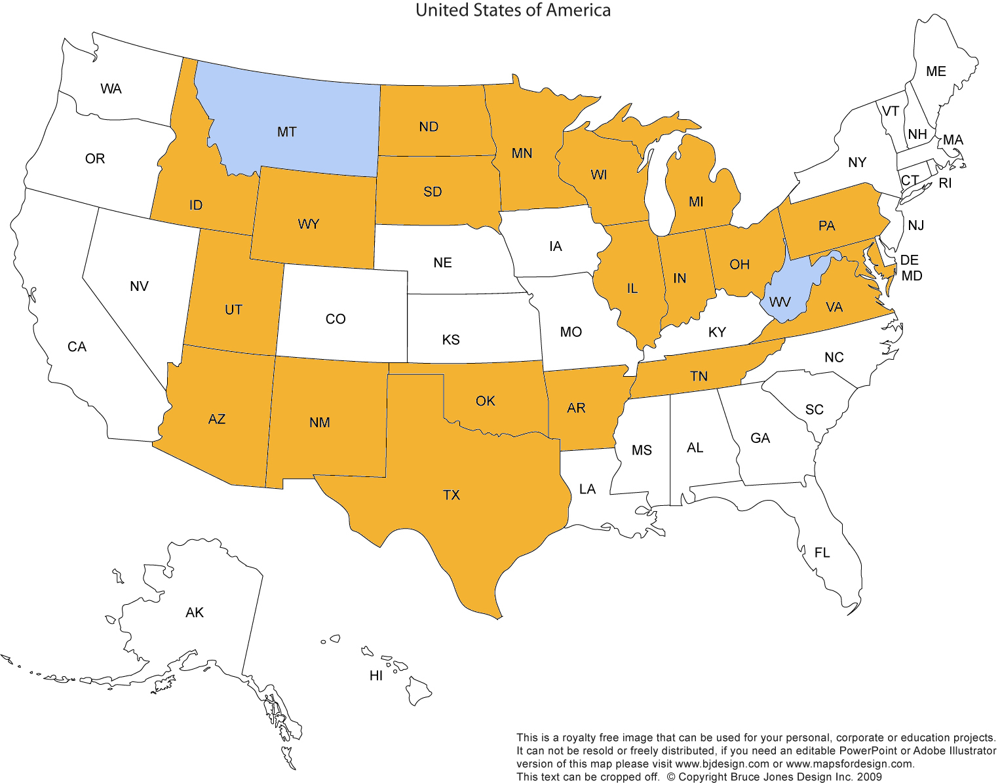

# States We Traveled Through (in order of travel)
1. Virginia
1. Tennessee
1. Arkansas
1. Oklahoma
1. Texas
1. New Mexico
1. Arizona
1. Utah
1. Idaho
1. Wyoming
1. South Dakota
1. North Dakota
1. Minnesota
1. Wisconsin
1. Illinois
1. Indiana
1. Michigan
1. Ohio
1. Pennsylvania
1. Maryland

# Resources for Booklet:
- USA Map: http://www.freeusandworldmaps.com/html/USAandCanada/USPrintable.html
- States Word Search: http://www.puzzles.ca/wordsearch/usa_states.html
- States Crossword Puzzle: http://www.ducksters.com/games/crossword_puzzle/united_states_geography.php
- License Plates: http://www.15q.net/curr.html
- State quizzes and maps: http://www.enchantedlearning.com/usa/statesbw/
- Booklet Maker: https://github.com/roberto-arista/Python-Print-Booklet

# Notes for creating the booklet

- Create a PDF using your favorite document creator
- The number of pages must be evenly divisible by 4 (a multiple of four).
- Follow the instructions on the github repo to install PyPDF2
  - Download the `print_booklet.py` file (or clone the repo)
  - Run as 
    ```
    python path/to/print_booklet.py path/to/Your-File.pdf
    ```
  - The generated file will be at `path/to/Your-File-IMPOSED.pdf`

# Printing tips

- Printing the PDF from Mac's Preview App: 
  - It's easiest if your printer can print Two-Sided, if so, select that option.
  - For the Orientation, select "Landscape"
  - In the Layout setting, select "Short-Edge Binding"
  - You can test that the settings are correct by printing just the first two pages.

# License

Most of the resources have some kind of open source license. Other's show a
copyright. I'm probably violating someone's copyright. Sorry. Let me know if
you want me to remove something and I will. If you want to use the resources,
check with each source for their copyright. 

As for what is in this repo, use whatever you like, however you like. If you
use a resource listed above, make sure to attribute back to them.
